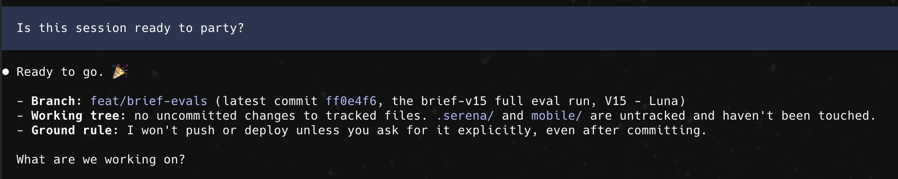
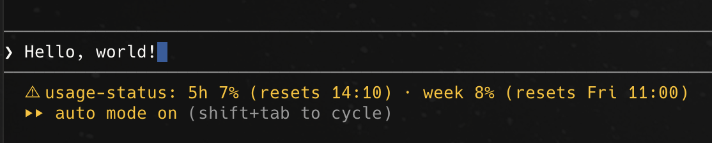
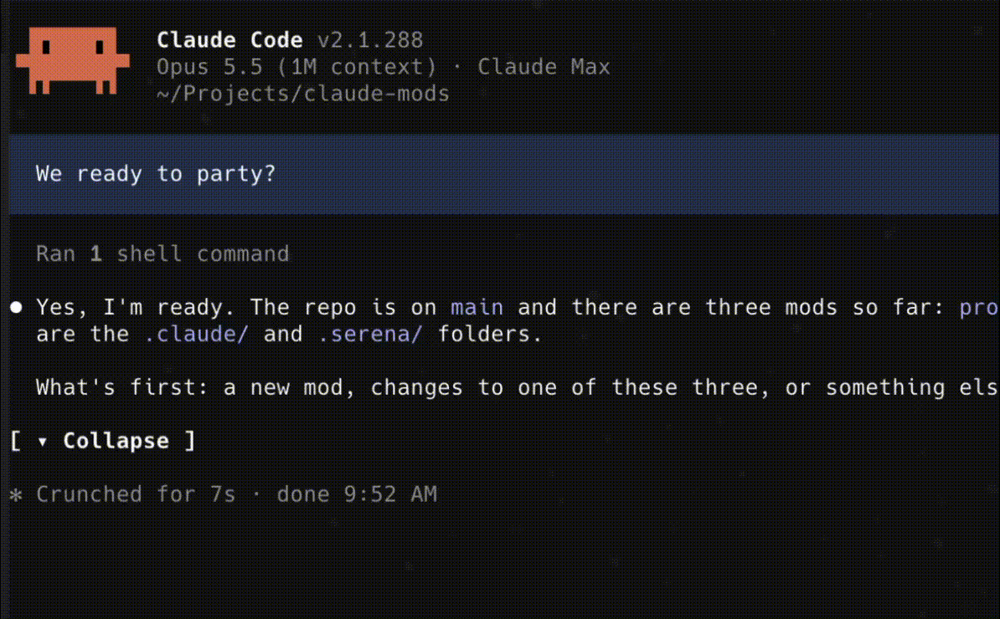

# claude-code-mods

Three small tweaks that make long [Claude Code](https://claude.com/claude-code) sessions easier to live with.

After a few hours in Claude Code, the same small annoyances kept getting in my way: I'd lose track of what I'd asked, scroll past screens of output to find my last question, and hit my usage limit without seeing it coming. Each mod here fixes one of those. They're tiny, they don't change how Claude works, and you can turn any of them off by removing one line from your settings.

## prompt-highlight: see your own questions at a glance

In a long conversation, your messages and Claude's answers are the same plain text, so scrolling back to find "what did I ask again?" means reading everything. This mod puts your messages on a colored band, so you can find them while you scroll.



## usage-status: know where you stand before you hit the limit

Claude subscriptions have two usage limits, one per 5 hours and one per week, and Claude Code doesn't show you either until you're close. This mod keeps both in the status line, with when each one resets, so you can decide whether to start a big task now or save it for later.



## collapse-answers: fold away what you've already read

Some answers run for screens: tool calls, file listings, long explanations. Once you've read one, it's just in the way. This mod adds a **▾ Collapse** button at the end of each answer. Press it and the whole answer folds down to one line under your question, which also makes the conversation easy to skim later. Press **▸ Show answer** to bring it back.



## Install

1. Clone the repo into `~/.claude/mods`:

   ```sh
   git clone https://github.com/adriancoman/claude-code-mods.git ~/.claude/mods
   ```

   If you already have a `~/.claude/mods` folder, clone it somewhere else and use that path below.

2. Tell Claude Code where the mods are. Open `~/.claude/settings.json` and add the ones you want to the `env` block, separated by `:` (`;` on Windows):

   ```json
   {
     "env": {
       "CLAUDE_CODE_PLUGIN_DIRS": "~/.claude/mods/prompt-highlight:~/.claude/mods/usage-status:~/.claude/mods/collapse-answers"
     }
   }
   ```

3. Start a new Claude Code session. That's it, there's nothing to build or install.

Want to try one first? This loads it for a single session only:

```sh
claude --plugin-dir ~/.claude/mods/collapse-answers
```

To update later, run `git pull` in `~/.claude/mods`.

## Good to know

- **usage-status** only works with a Claude subscription (Pro, Max, Team). On an API key there are no limits to show. The numbers update after each answer, so they'll appear once Claude has replied at least once.
- **collapse-answers** only adds the button to answers given after the mod loaded, not to older ones.
- **Don't like the blue?** Change `BACKGROUND` at the top of `prompt-highlight/hooks/index.tsx`.
- These are built on Claude Code's mod API, which is still early access (tested on Claude Code 2.1.287). A future update could break them. If that happens, please open an issue.

## Making changes

Each mod is a folder with a short TypeScript file in `hooks/`. To check a mod after editing it, run `claude plugin validate <mod folder>`. Once Claude Code has loaded a mod, it adds type definitions to the folder, and `tsc -p <mod folder>` will type-check your changes.

## License

MIT
